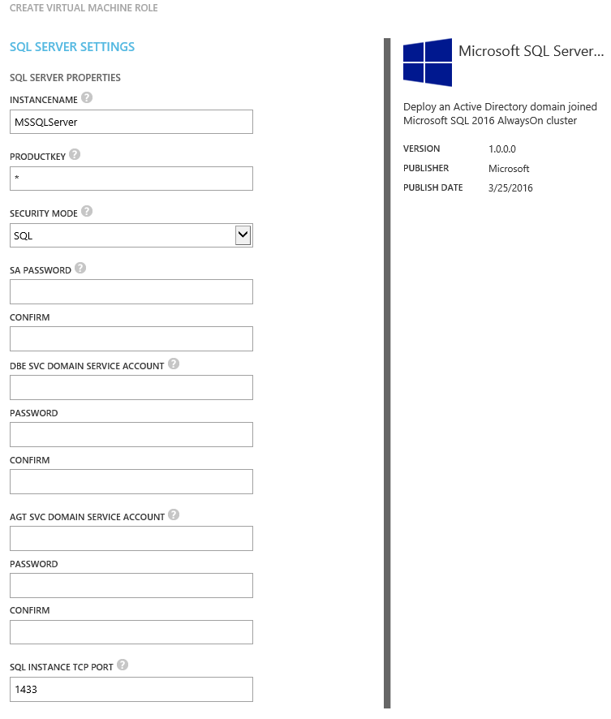
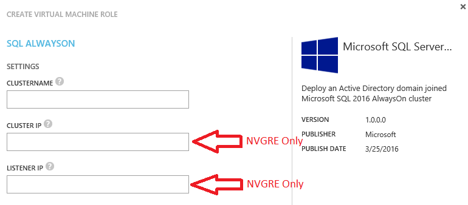

#SQL 2016 Always On
Windows Azure Pack Gallery Resource

## Overview
The SQL 2016 Always On gallery resources enable a service provider to publish a gallery item for tenants to deploy two Active Directory Domain joined SQL 2016 Always On virtual machines on Windows Server 2012 R2. Additionally, the user may optionally supply a SQL Server product key (if a product key is not provided, the SQL Servers will be configured in evaluation mode).
In order to publish the gallery resources as a gallery item, you must: 
- Import the resource extension package into System Center Virtual Machine Manager.
- Ensure the virtual hard disks in SCVMM are properly prepared and have all the necessary properties set.
- Import the resource definition package as a gallery item.
- Make the gallery item public.
- Add the gallery item to a plan.

This VM Role comes in 3 editions:
* NVGRE for Network virtualization.
* VLAN Static for VLAN with Static IP Pool.
* VLAN DHCP for VLAN with DHCP service.
The service provider has to pick the edition which reflects the underlying Network setup.

##System Center Virtual Machine Manager 
In order to use a gallery resource, you must take the following actions in System Center Virtual Machine Manager.
###Import Resource Extension Package
Using PowerShell, you must import the resource extension package into the virtual machine manager library.  
Sample Windows PowerShell:
```PowerShell
$libsharepath = '' #you must set the library sharepath from your environment
$resextpkg = 'c:\GalleryResources\SQL2016AO\SQLServer2016AlwaysOn - NVGRE.resextpkg'
Import-CloudResourceExtension –ResourceExtensionPath $resextpkg  –SharePath $libsharepath -AllowUnencryptedTransfer
```
The import can only be done using PowerShell.
To verify the import, run the Get-CloudResourceExtension PowerShell command and locate the newly imported extension.
```PowerShell
Get-CloudResourceExtension
```
###Prepare the virtual hard disks
A virtual hard disk containing a sysprepped version of one of the available editions of Windows Server 2012R2 with a prepared instance of SQL Server 2016 must be added to a SCVMM library share.
####Download Evaluations
Evaluations of Windows Server 2012R2 / 2016 and SQL Server 2016 can be downloaded at the evaluation center.
- [SQL 2016](https://www.microsoft.com/en-us/evalcenter/evaluate-sql-server-2016)
- [Windows Server 2012R2](https://www.microsoft.com/en-us/evalcenter/evaluate-windows-server-2012-r2)

####Prepare OS disk
- Create a new VM. Make sure you choose the VM generation for which the VM Role will be created (you can't deploy Gen1 vhdx images to a Gen2 enabled cloud and vice versa).  
  
- Install one of the supporting Windows Server versions to it. Only UI is supported.
  
    - Windows Server 2012 R2 Datacenter Preview
    - Windows Server 2012 R2 Standard Preview  
- Make sure the VM has internet access.
- Install .Net Framework 3.5
```PowerShell
Install-WindowsFeature -Name NET-Framework-Core
```
- Install SQL Sysprep
    - Mount the SQL 2016 Media
    - Install
    ```bat
    .\Setup.exe /qs /ACTION=PrepareImage /FEATURES=SQLEngine /instanceID=MSSQLSERVER /IACCEPTSQLSERVERLICENSETERMS
    ```
- Install SQL Server Management Studio  
    - [Download](https://msdn.microsoft.com/en-us/library/mt238290.aspx)
    - Install
- [optional] Fully patch the OS
- Reboot
- Run sysprep to generalize the image
```bat
Sysprep.exe /generalize /oobe /shutdown
```

####Prepare Data Disks
The SQL 2016 Always On VMRole depends on the presence of 2 data disks.
On a server with Hyper-V enabled run:
```PowerShell
New-VHD -Path C:\SQLLog.vhdx -SizeBytes 200GB -Dynamic
New-VHD -Path C:\SQLData.vhdx -SizeBytes 500GB -Dynamic
```

####Library properties
Once the VHDx Files are added to the library and have been discovered, they need to be updated with the correct metadata.
```PowerShell
#Example Gen2
Get-SCVirtualHardDisk -Name Win2012R2WithSQL2016_UEFI.vhdx | Set-SCVirtualHardDisk -Tag @('MicrosoftSQLServer2016') -Release 1.0.0.0 -FamilyName 'Windows Server 2012 R2 UEFI SQL 2016' -VirtualizationPlatform HyperV -OperatingSystem 'Windows Server 2012 R2 Datacenter' -ProductKey 'Enter Product Key here'
#Example Gen1
Get-SCVirtualHardDisk -Name Win2012R2WithSQL2016.vhdx | Set-SCVirtualHardDisk -Tag @('MicrosoftSQLServer2016') -Release 1.0.0.0 -FamilyName 'Windows Server 2012 R2 SQL 2016' -VirtualizationPlatform HyperV -OperatingSystem 'Windows Server 2012 R2 Datacenter' -ProductKey 'Enter Product Key here'

#Datadisks
Get-SCVirtualHardDisk -Name SQLLog.vhdx | Set-SCVirtualHardDisk -VirtualizationPlatform HyperV -OperatingSystem None -Release 1.0.0.0 -FamilyName SQLLog -Tag @('WAPHIDDEN')
Get-SCVirtualHardDisk -Name SQLData.vhdx | Set-SCVirtualHardDisk -VirtualizationPlatform HyperV -OperatingSystem None -Release 1.0.0.0 -FamilyName SQLData -Tag @('WAPHIDDEN')
```
###Windows Azure Pack Service Administrator Portal
Once the resource extension and virtual hard disk are all correctly set in SCVMM, you can import the resource definition package using the Service Administrator Portal in the Windows Azure Pack.

####Import Resource Definition Package 
- Open the Service Admin Portal.
- Navigate to the VM Clouds workspace.
- Click the Gallery tab.
- Click Import.
- To enable WORKGROUP-based virtual machine role deployments, select and import the SQLServer2016Workgroup.resdefpkg file in the unzipped location. 
- To enable Active Directory Domain join virtual machine role deployments, select and import the SQLServer2016Domain.resdefpkg file in the unzipped location.
- Note that the gallery item now is listed on the Gallery tab.
Now that the packages for the Virtual Machine Role have been installed, you can publish the gallery item to make it available to tenants.

####Publish gallery item and add to a plan
To make the Virtual Machine Role available to the tenant, you need to add it to a plan. In this procedure, you publish the Virtual Machine Role that you installed.
- On the Gallery tab, select the version of the gallery item that you just imported.
- Click the arrow next to the gallery item name.
- Explore the details of the gallery item.
- Navigate back and click Make Public.
- Select the Plans workspace in the Service Admin Portal.
- Select the plan to which you want to add this gallery item.
- Select the Virtual Machine Clouds service.
- Scroll to the Gallery section.
- Click Add Gallery Items.
- Select the gallery items that you imported, and then click Save.  
The Virtual Machine Role is now available to the tenant as part of the selected plan.

##Deployment settings
When deploying this virtual machine role, the user provides mandatory and optional values:  
  
- **InstanceName**  
The disired instance name should be specified here. MSSQLServer is the default instancename. 
- **Productkey**  
A SQL Product key should be specified here. For evaluation, leave a star (*).  
- **Security Mode**  
    * Windows: Allow for authentication using Windows local and AD accounts besides SQL accounts.
    * SQL: Allow for authentication by SQL accounts only.  
- **SA Password**  
The Password for the SA Account. 
- **DBE SVC Domain Service Account**  
A domain service account used to run the SQL Database service.  
- **AGT SVC Domain Service Account**  
A domain service account used to run the SQL Agent service.  
- **SQL Instance TCP Port**  
The port on which the SQL instance should listen (default 1433).  
*The Always On listener is always configured with the default listener (1433)*

Depending on the Network setup NVGRE, VLAN Static or VLAN DHCP all or some of the following values have to be provided by the user as well:  
  
- **ClusterName**  
This settings always needs to be provided and is used to build the Windows Cluster.  
For the Always On listener, this value is appended with *"-AO"* (e.g. SQLClus01-AO)  
- **Cluster IP**  
This setting only surfaces in the NVGRE VM Role (this is necaserry as the DHCP protocol used with NVGRE is not RFC compliant).  
It has to be an IP address which is available within the virtual network subnet space of the tenant.  
*For VLAN Static, besides the two IP addresses for the VMs, an additional one is reserved from the static IP pool.*  
*For VLAN DHCP, a DHCP server assigns this IP address.*  
- **Listener IP**  
This setting only surfaces in the NVGRE VM Role (this is necaserry as the DHCP protocol used with NVGRE is not RFC compliant).  
*For VLAN Static, besides the two IP addresses for the VMs, an additional one is reserved from the static IP pool.*  
*For VLAN DHCP, a DHCP server assigns this IP address.*  

##Active Directory
The domain join account used with this VM Role must have aditional Active Directory permissions.  
On the OU or container in which Computer accounts are created by default the domain join account needs full controll on computer objects within that OU or container.